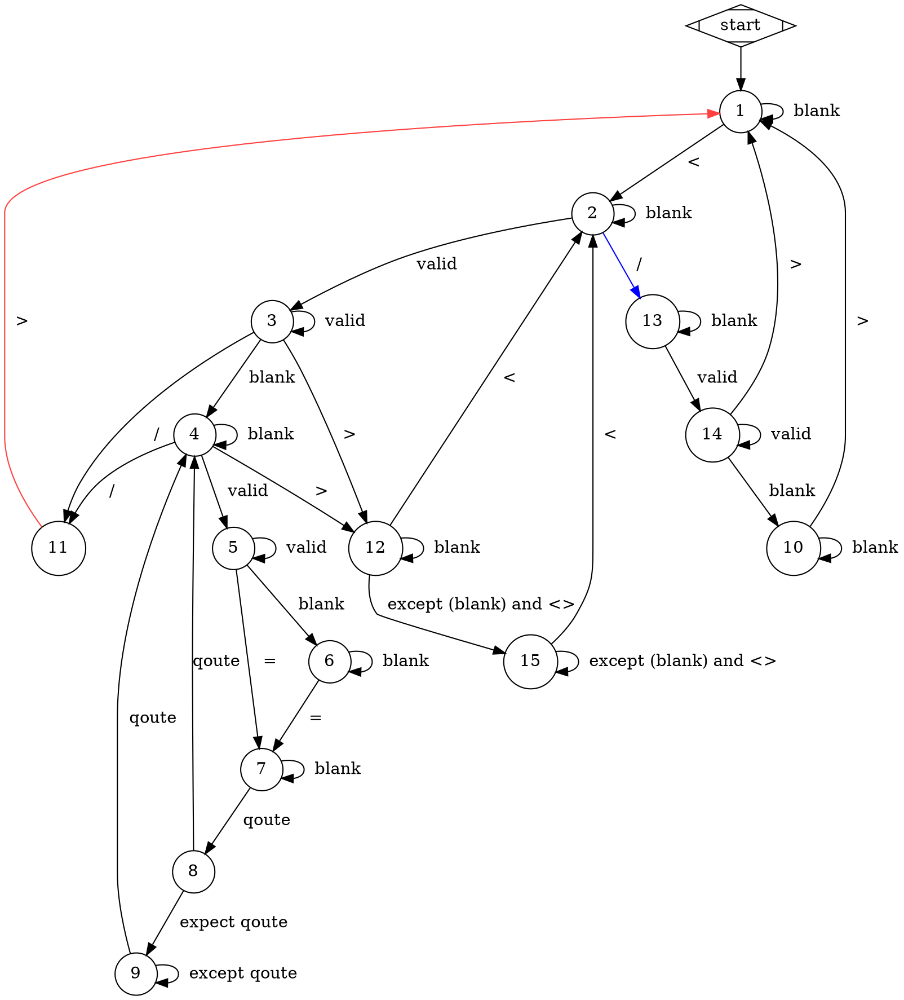

# SlowXml: A Pure Kotlin Xml Parser

life is short, may time slow down

## Installation

1. create a file named `gpr.properties` in your project root, filling with:
   ```kotlin
   gpr.user="your username"
   gpr.key="your token"
   ```
    make sure you've added `gpr.properties` in **.gitignore** file !!!!

3. add `gpr` to your `repositories` section 
    ```kotlin
    maven {
        url = uri("https://maven.pkg.github.com/whiterasbk/slowxml")
        credentials {
            username = project.findProperty("gpr.user") as String? ?: System.getenv("USERNAME")
            password = project.findProperty("gpr.key") as String? ?: System.getenv("GITHUB_TOKEN")
        }
    }
    ```
    
    alternatively, `jitpack` is available within a few certain version
   ```kotlin
   repositories {
       maven { url = uri("https://jitpack.io") }
   }
   ```
   while using `jitpack`, you don't need a `gpr.properties` file, but latest version has to be only `0.2`
   
5. add `slowxml` to your `dependencies` section
    ```kotlin
    dependencies {
        implementation("com.github.whiterasbk:slowxml-$platform:$latest_version")
        // where platform be like: js, jvm
        // version may check in latest release
    }
    ```
6. sync `build.gradle.kts`

## How to use

use `parseXml` function by passing xml string, it will return a `XmlNode` object representing the xml string

here's a simple sample:

```kotlin
val node = parseXml("<root attr=\"value\"> 123 </root>")
```

and you will be able to access its attributes through `node.attrbutes`, text content through `node.content`

also, if you prefer diving into it, `loopInXmlString` brings more flexibility:
```kotlin
var get = ""
loopInXmlString("<r> <!-- comment --> </a>") {     
    onComment { get = it }
}
```

by calling `onComment` function, `loopInXmlString` will automate invoke the given lambda

as the inside pointer meet comment, `get` will be set to ` comment `, then you can dill with it 

the following is supported hooks:

- `onOpenTag`
- `onCloseTag`
- `onEndDefineAttributes`
- `onAttributeName`
- `onAttributeValue`
- `onComment`
- `onTextContent`

## How does it work

`slowxml` uses state machine to parse xml string into objects


this state machine will change its state according to current pinter and state, which make the computer knows what the stage is it now

the state `11` switch to `1` happens only when meet close tag, no matter self close tag or not, base on this judgement, we can start our procession  

```kotlin
when {
    //    ...
    previousState == 11 and currentState == 1 -> {
        // meet close tag, create a new node
    }
    //    ...
}
```
other situations can also be analyzed from below


link to [GraphvizOnline](https://dreampuf.github.io/GraphvizOnline/?url=https://raw.githubusercontent.com/whiterasbk/slowxml/master/state-machine.dot) to fully and lively access its code
